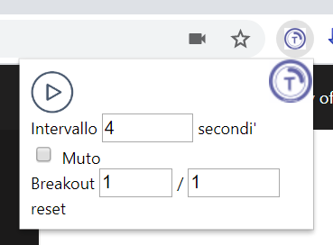

# TeamsCarousel

> Quick start guide in [english](packages/quickstart-en.md)

> Guida rapida in [italiano](packages/quickstart-it.md)

This Chrome (and Edge Chromium) extension is designed to cycle among the participants of a Microsoft Teams call. It is a hack and therefore instable, mostly needed to support the Italian Universities to monitor written exams during COVID-19 distance learning.

It is known that Microsoft is working on a 3x3 grid view for the Microsoft Teams client, but for this specific use case is to be preferred to iterate among call participants from a Web browser.

## Using the extension

The extension is shown on the right of the address bar

It will be enabled only when browsing the Web site https://teams.microsoft.com

During a call click on the icon to get the following menu:

Press play to start the carousel. You can change the interval duration at any time by changing the number of seconds in the menu. More options to come in the future.

## The approach
Since the Microsoft Teams API does not allow such a fine control over the client I used the ability of a Chrome extension to interact with the DOM in the active Tab page. It is a fragile solution since any change to the HTML5 will require an update of the extension. Moreover, javascript environment of a running extension is separated from the Web page for obvious security reasons, thus the only option for interaction is through the DOM shared between the extension and the page. Given the urgency I resorted to more conservative techniques such as timers instead of promises, but I'd like to clean up the code over time.

The code simply pins and unpins call participants with a given timer that can be configured with the popup of the extension.

The *suggested* use is to connect to a Microsoft Teams call with the native client *and* with the Web browser so that any disruption to the plugin can be easily fixed by reloading the page without loosing the conference connection. In this case the cam, mic and tab's audio should be off so that the carousel will act as a monitor.

## Installation
As of today Google Chrome store is not accepting extension submissions (it fails by returning internal server error). The only way to use the plugin is by installing it manually. I plan to fix the situation as soon as Google will reopen submissions.

On the contrary, Microsoft store allowed me to submit now I'm waiting for the review (it was quick so I hope they will pass it)